# API de Monitoramento de Processos Jurídicos - Arquitetura

## 1. Visão Geral da Arquitetura

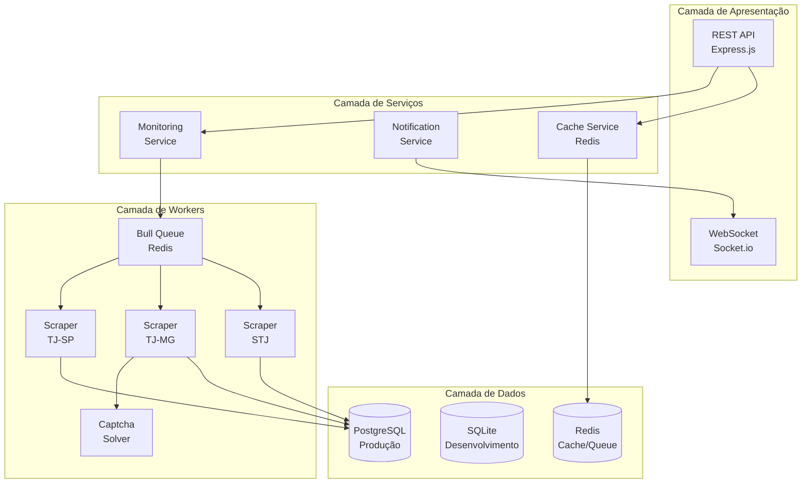

## 2. Modelo de Dados

### 2.1 Diagrama ER (Entidade-Relacionamento)

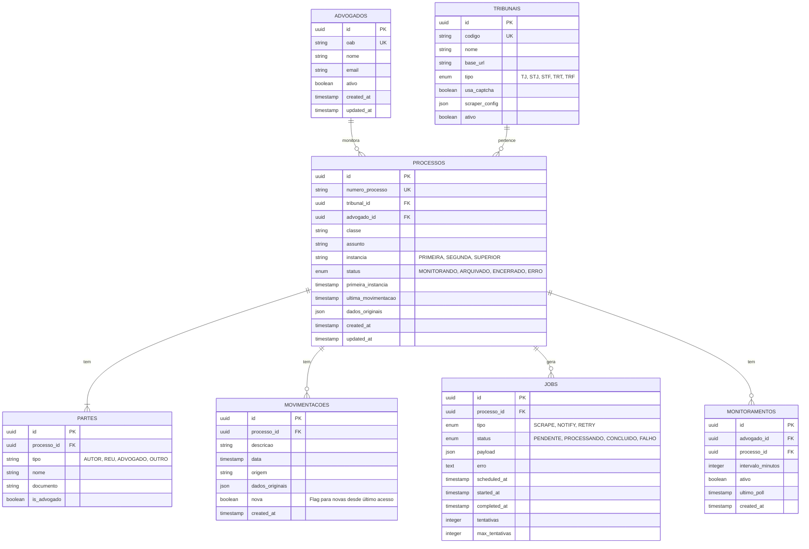

### 2.2 Especificação das Tabelas

#### `advogados`
| Campo | Tipo | Constraints |
|-------|------|-------------|
| id | UUID | PK, DEFAULT uuid_generate_v4() |
| oab | VARCHAR(20) | UNIQUE, NOT NULL |
| nome | VARCHAR(255) | NOT NULL |
| email | VARCHAR(255) | |
| ativo | BOOLEAN | DEFAULT true |
| created_at | TIMESTAMP | DEFAULT NOW() |
| updated_at | TIMESTAMP | DEFAULT NOW() |

#### `tribunais`
| Campo | Tipo | Constraints |
|-------|------|-------------|
| id | UUID | PK |
| codigo | VARCHAR(10) | UNIQUE, NOT NULL |
| nome | VARCHAR(100) | NOT NULL |
| base_url | TEXT | NOT NULL |
| tipo | ENUM | TJ, STJ, STF, TRT, TRF |
| usa_captcha | BOOLEAN | DEFAULT false |
| scraper_config | JSONB | |
| ativo | BOOLEAN | DEFAULT true |

#### `processos`
| Campo | Tipo | Constraints |
|-------|------|-------------|
| id | UUID | PK |
| numero_processo | VARCHAR(50) | UNIQUE, NOT NULL |
| tribunal_id | UUID | FK → tribunais |
| advogado_id | UUID | FK → advogados |
| classe | VARCHAR(255) | |
| assunto | TEXT | |
| instancia | ENUM | PRIMEIRA, SEGUNDA, SUPERIOR |
| status | ENUM | MONITORANDO, ARQUIVADO, ENCERRADO, ERRO |
| dados_originais | JSONB | |
| created_at | TIMESTAMP | DEFAULT NOW() |
| updated_at | TIMESTAMP | DEFAULT NOW() |

#### `partes`
| Campo | Tipo | Constraints |
|-------|------|-------------|
| id | UUID | PK |
| processo_id | UUID | FK → processos |
| tipo | ENUM | AUTOR, REU, ADVOGADO, OUTRO |
| nome | VARCHAR(255) | NOT NULL |
| documento | VARCHAR(50) | |
| is_advogado | BOOLEAN | DEFAULT false |

#### `movimentacoes`
| Campo | Tipo | Constraints |
|-------|------|-------------|
| id | UUID | PK |
| processo_id | UUID | FK → processos |
| descricao | TEXT | NOT NULL |
| data | TIMESTAMP | NOT NULL |
| origem | VARCHAR(50) | |
| dados_originais | JSONB | |
| nova | BOOLEAN | DEFAULT true |
| created_at | TIMESTAMP | DEFAULT NOW() |

**Índice:** `(processo_id, data DESC)`

#### `jobs`
| Campo | Tipo | Constraints |
|-------|------|-------------|
| id | UUID | PK |
| processo_id | UUID | FK → processos |
| tipo | ENUM | SCRAPE, NOTIFY, RETRY |
| status | ENUM | PENDENTE, PROCESSANDO, CONCLUIDO, FALHO |
| payload | JSONB | |
| erro | TEXT | |
| scheduled_at | TIMESTAMP | DEFAULT NOW() |
| started_at | TIMESTAMP | |
| completed_at | TIMESTAMP | |
| tentativas | INTEGER | DEFAULT 0 |
| max_tentativas | INTEGER | DEFAULT 3 |

**Índice:** `(status, scheduled_at)` para busca de jobs pendentes

#### `monitoramentos`
| Campo | Tipo | Constraints |
|-------|------|-------------|
| id | UUID | PK |
| advogado_id | UUID | FK → processos |
| processo_id | UUID | FK → processos |
| intervalo_minutos | INTEGER | DEFAULT 60 |
| ativo | BOOLEAN | DEFAULT true |
| ultimo_poll | TIMESTAMP | |

**Índice:** `(advogado_id, ativo)`

## 3. Estratégia de Integração com Tribunais

### 3.1 Classificação por Complexidade

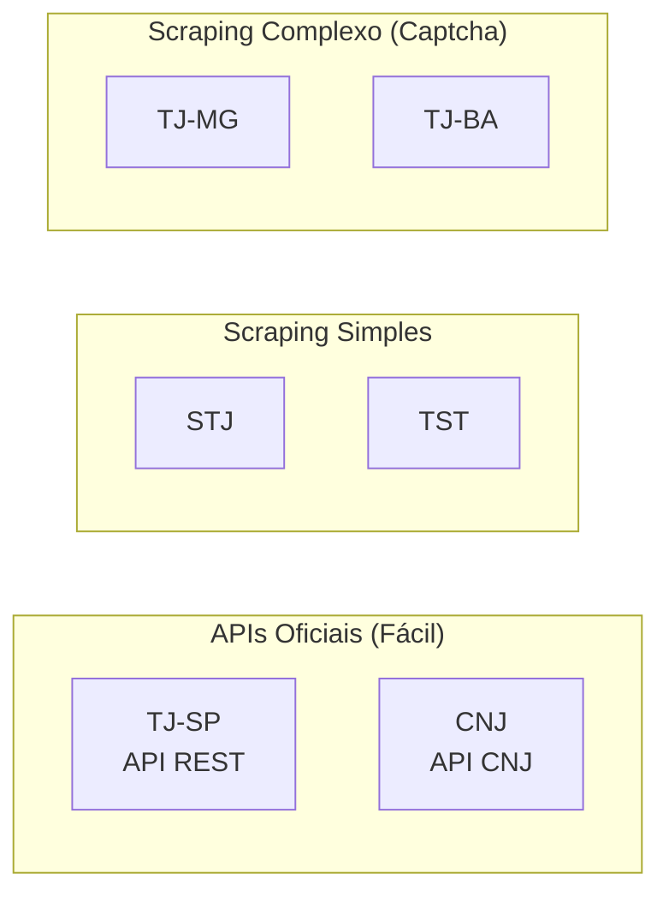

### 3.2 Adapter Pattern para Tribnais

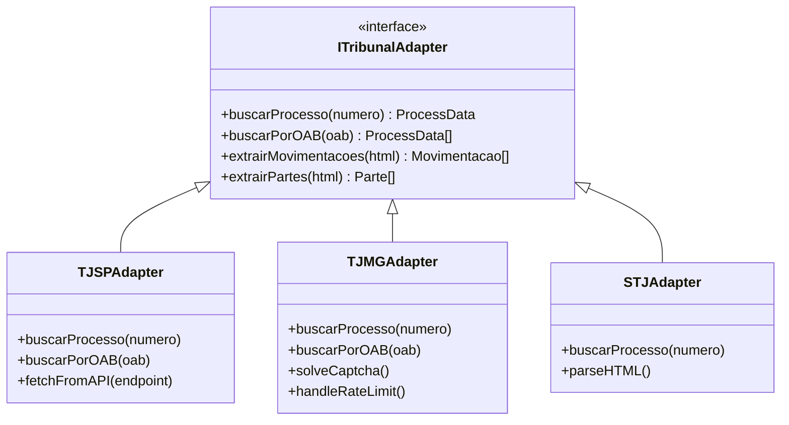

### 3.3 Detalhamento por Tribunal

#### TJ-SP (Prioridade Alta)
- **Método**: API REST oficial
- **Base URL**: `https://api.tjsp.jus.br`
- **Autenticação**: API Key ou OAuth
- **Rate Limit**: Respeitar headers `X-RateLimit-*`
- **Formato**: JSON estruturado

#### TJ-MG (Prioridade Média-Alta)
- **Método**: Scraping com CAPTCHA
- **Ferramentas**: Puppeteer + 2Captcha
- **Estratégia Anti-Block**:
  - Rotação de User-Agents
  - Delays randômicos (3-8s entre requests)
  - Proxy rotation
  - Headless browser detection bypass

#### STJ/STF/TST (Prioridade Média)
- **Método**: Scraping com parsers HTML
- **Formato**: HTML semiestruturado
- **Rate Limit**: 1 request cada 10 segundos

## 4. Sistema de Scraping com CAPTCHA

### 4.1 Arquitetura do Scraper

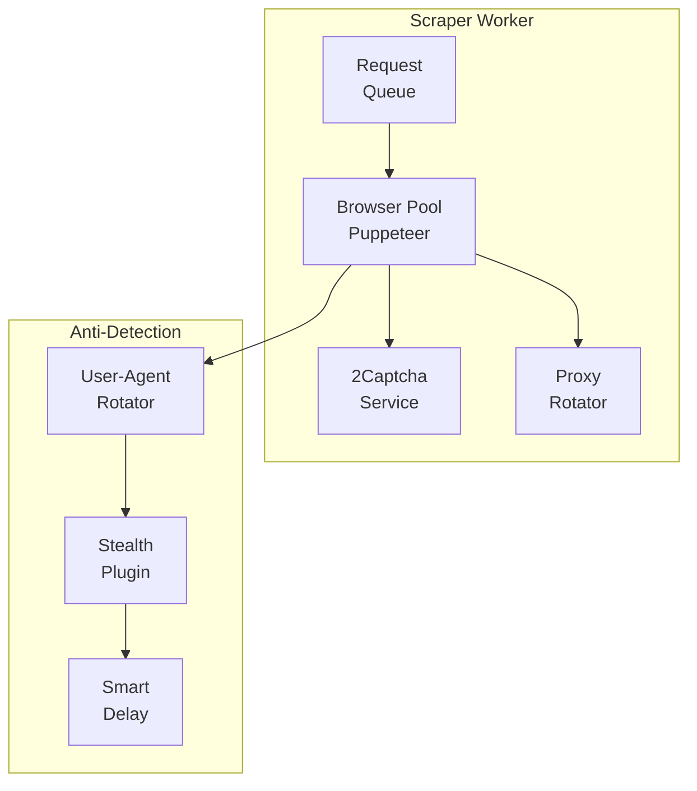

### 4.2 Fluxo de Resolução de CAPTCHA

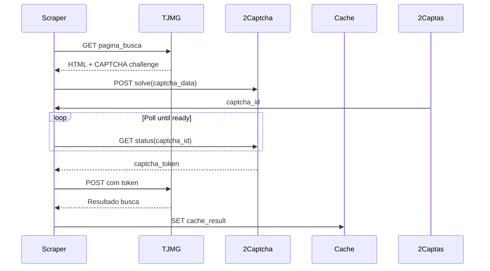

### 4.3 Estratégias Anti-Bloqueio

1. **User-Agent Rotation**: Lista de 50+ UAs de browsers reais
2. **Proxy Pool**: Rotação de proxies residenciais
3. **Smart Delays**: 
   - Base: 3-8 segundos randômico
   - Aumento progressivo em caso de erro
   - Cooldown após blocos temporários
4. **Browser Fingerprint Spoofing**: Bloquear detecção de automation
5. **Retry exponencial**: 1min → 5min → 15min → 1h

## 5. Sistema de Filas e Workers

### 5.1 Arquitetura de Filas

```mermaid
flowchart TB
    subgraph "Bull Queues"
        SCRAPE[SCRAPE<br/>Queue]
        NOTIFY[NOTIFY<br/>Queue]
        RETRY[RETRY<br/>Queue]
        CLEANUP[CLEANUP<br/>Queue]
    end
    
    subgraph "Workers"
        SW1[SCRAPE<br/>Worker 1]
        SW2[SCRAPE<br/>Worker 2]
        NW1[NOTIFY<br/>Worker]
        RW1[RETRY<br/>Worker]
    end
    
    subgraph "Scheduler"
        Cron[Bull<br/>Scheduler]
    end
    
    Cron -->|"every 5min", SCRAPE: monitoramentos
    Cron -->|"daily", CLEANUP: old_jobs
    
    SCRAPE --> SW1
    SCRAPE --> SW2
    NOTIFY --> NW1
    RETRY --> RW1
```

### 5.2 Tipos de Jobs

| Queue | Prioridade | Concorrência | Retry Policy |
|-------|------------|--------------|--------------|
| SCRAPE | Alta (10) | 3 workers | 3x com backoff |
| NOTIFY | Alta (10) | 2 workers | 5x rápido |
| RETRY | Baixa (5) | 1 worker | 1x |
| CLEANUP | Baixa (1) | 1 worker | 0 |

### 5.3 Fluxo de Processamento

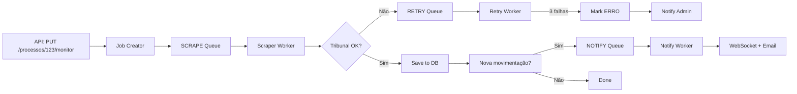

## 6. Endpoints da API REST

### 6.1 Visão Geral dos Endpoints

```
GET    /api/v1/health
POST   /api/v1/auth/login

# Advogados
GET    /api/v1/advogados
POST   /api/v1/advogados
GET    /api/v1/advogados/:id
PUT    /api/v1/advogados/:id
DELETE /api/v1/advogados/:id
GET    /api/v1/advogados/:id/processos

# Processos
GET    /api/v1/processos
POST   /api/v1/processos
GET    /api/v1/processos/:id
PUT    /api/v1/processos/:id
DELETE /api/v1/processos/:id
GET    /api/v1/processos/:numero/tribunal/:tribunal
POST   /api/v1/processos/:id/buscar

# Monitoramento
GET    /api/v1/processos/:id/movimentacoes
GET    /api/v1/processos/:id/movimentacoes/novas
GET    /api/v1/processos/:id/partes
POST   /api/v1/processos/:id/monitorar
DELETE /api/v1/processos/:id/monitorar
GET    /api/v1/monitoramentos

# Busca
GET    /api/v1/busca/oab/:oab
GET    /api/v1/busca/nome/:nome

# Jobs
GET    /api/v1/jobs/:processoId
GET    /api/v1/jobs/status/:status

# Webhooks
POST   /api/v1/webhooks
GET    /api/v1/webhooks
DELETE /api/v1/webhooks/:id
```

### 6.2 Especificação Detalhada

#### `POST /api/v1/processos/:id/buscar`
Busca dados atualizados de um processo específico.

**Request:**
```json
{
  "forcar": true
}
```

**Response (200):**
```json
{
  "processo": {
    "id": "uuid",
    "numero": "0001234-12.2023.8.26.0001",
    "tribunal": "TJSP",
    "status": "MONITORANDO",
    "movimentacoes_novas": 3,
    "ultima_atualizacao": "2024-01-15T14:30:00Z"
  }
}
```

#### `GET /api/v1/processos/:id/movimentacoes`
Lista todas as movimentações de um processo.

**Query Params:**
- `pagina` (default: 1)
- `limite` (default: 50, max: 200)
- `data_inicio` (ISO 8601)
- `data_fim` (ISO 8601)

**Response (200):**
```json
{
  "movimentacoes": [
    {
      "id": "uuid",
      "data": "2024-01-15T10:00:00Z",
      "descricao": "Juntada de petição",
      "origem": "TJSP",
      "nova": false
    }
  ],
  "pagination": {
    "pagina": 1,
    "limite": 50,
    "total": 245,
    "paginas": 5
  }
}
```

#### `POST /api/v1/webhooks`
Registra webhook para notificações.

**Request:**
```json
{
  "url": "https://sistema-advocacia.com/webhook",
  "eventos": ["movimentacao.nova", "processo.erro"],
  "advogado_id": "uuid-advogado",
  "secret": "webhook_secret_para_hmac"
}
```

### 6.3 Formato de Erro

```json
{
  "erro": {
    "codigo": "PROCESSO_NAO_ENCONTRADO",
    "mensagem": "Processo 0001234-12.2023.8.26.0001 não encontrado no TJ-SP",
    "detalhes": {
      "numero": "0001234-12.2023.8.26.0001",
      "tribunal": "TJSP"
    },
    "timestamp": "2024-01-15T14:30:00Z"
  }
}
```

## 7. Sistema de Monitoramento (Polling)

### 7.1 Arquitetura de Polling

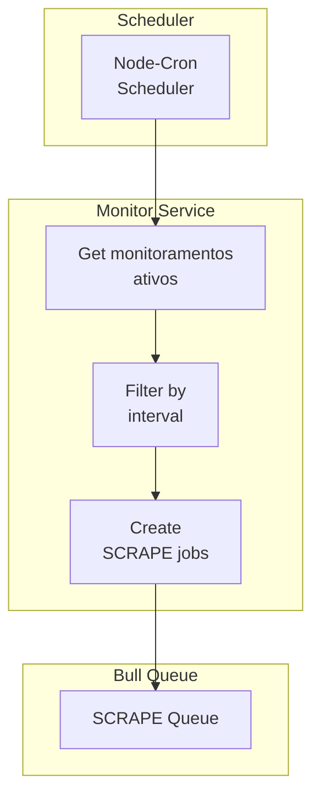

### 7.2 Intervalos de Polling

| Tipo de Processo | Intervalo Padrão | Intervalo Mínimo |
|------------------|------------------|------------------|
| Ativo (últimos 30 dias) | 60 minutos | 15 minutos |
| Instância Superior | 120 minutos | 30 minutos |
| Arquivado | 24 horas | 6 horas |
| Prioridade Alta | 15 minutos | 5 minutos |

### 7.3 Detecção de Novas Movimentações

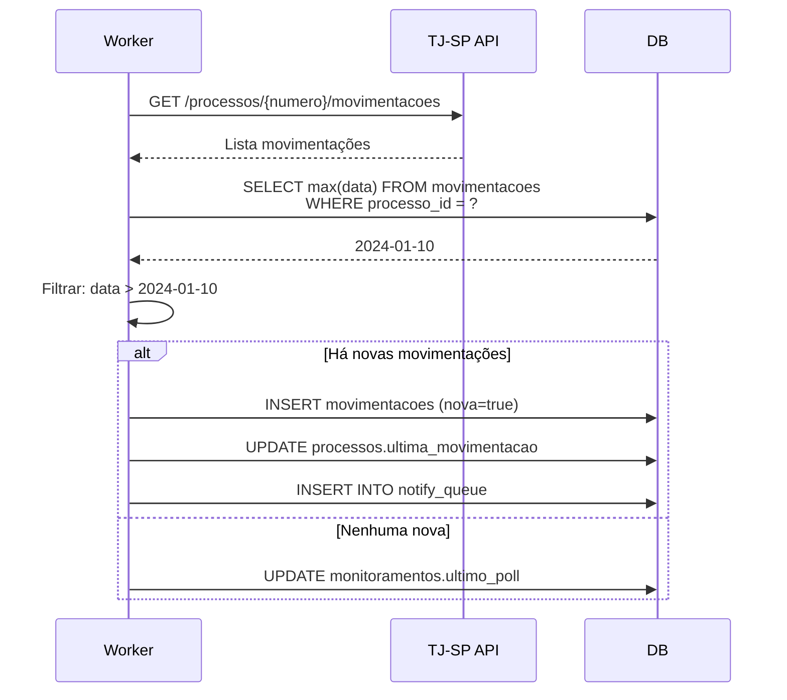

## 8. Tratamento de Erros e Retry

### 8.1 Estratégia de Retry

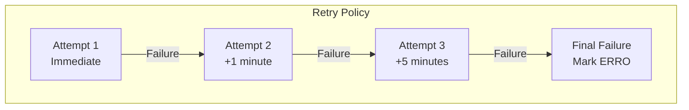

| Tipo de Erro | Max Tentativas | Backoff | Ação Final |
|--------------|----------------|---------|------------|
| Timeout | 3 | 1min, 5min | Mark ERRO |
| Rate Limit | 5 | 5min, 15min, 1h | Wait 1h, retry |
| CAPTCHA | 3 | 2min | Mark NEEDS_CAPTCHA |
| Server Error (5xx) | 3 | 30s, 1min, 5min | Mark ERRO |
| Not Found | 1 | - | Mark NOT_FOUND |
| Auth Error | 1 | - | Alert Admin |

### 8.2 Códigos de Erro

| Código | HTTP Status | Descrição |
|--------|-------------|-----------|
| PROCESSO_NAO_ENCONTRADO | 404 | Processo não existe no tribunal |
| TRIBUNAL_NAO_SUPORTADO | 400 | Tribunal ainda não implementado |
| CAPTCHA_NAO_RESOLVIDO | 503 | CAPTCHA não pôde ser resolvido |
| RATE_LIMIT_EXCEDIDO | 429 | Muitoas requisições ao tribunal |
| SCRAPER_ERRO | 500 | Erro interno no scraper |
| AUTENTICACAO_FALHOU | 401 | Credenciais inválidas |
| JOB_SEM_RESPOSTA | 504 | Job excedeu tempo limite |

## 9. Cache e Otimizações

### 9.1 Estratégia de Cache

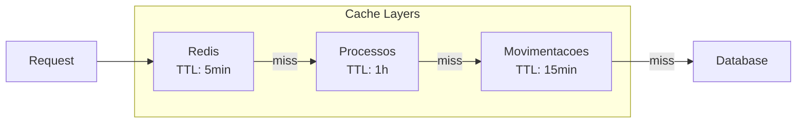

### 9.2 Keys de Cache

| Key Pattern | TTL | Descrição |
|-------------|-----|-----------|
| `processo:{numero}` | 1h | Dados completos do processo |
| `movimentacoes:{processo_id}` | 15min | Lista de movimentações |
| `partes:{processo_id}` | 1h | Partes do processo |
| `tribunal:{codigo}:status` | 5min | Status de disponibilidade |
| `oab:{oab}:processos` | 30min | Lista de processos por OAB |

### 9.3 Índices do Banco

```sql
-- Performance crítica
CREATE INDEX idx_movimentacoes_processo_data ON movimentacoes(processo_id, data DESC);
CREATE INDEX idx_processos_advogado ON processos(advogado_id);
CREATE INDEX idx_processos_tribunal ON processos(tribunal_id);
CREATE INDEX idx_jobs_status_scheduled ON jobs(status, scheduled_at) WHERE status = 'PENDENTE';
CREATE INDEX idx_monitoramentos_advogado_ativo ON monitoramentos(advogado_id, ativo) WHERE ativo = true;
```

## 10. WebSocket para Tempo Real

### 10.1 Eventos

```javascript
// Cliente se inscreve
socket.emit('subscribe', { 
  advogado_id: 'uuid',
  processo_ids: ['uuid1', 'uuid2'] 
});

// Server notifica novas movimentações
socket.emit('movimentacao.nova', {
  processo_id: 'uuid',
  movimentacao: { id, data, descricao }
});

socket.emit('processo.status', {
  processo_id: 'uuid',
  status: 'MONITORANDO',
  ultima_movimentacao: '2024-01-15'
});
```

### 10.2 Autenticação WebSocket

```javascript
// Cliente autentica
socket.emit('auth', { 
  token: 'jwt_token' 
});

// Server valida e responde
socket.on('auth.success', () => {
  console.log('Inscrito em notificações');
});

socket.on('auth.error', (err) => {
  console.error('Falha autenticação:', err);
});
```

## 11. Estrutura de Diretórios

```
minha-api/
├── src/
│   ├── config/
│   │   ├── database.js          # Configuração Sequelize
│   │   ├── redis.js             # Configuração Redis
│   │   └── tribunal.js          # URLs e credenciais de tribunais
│   │
│   ├── models/
│   │   ├── index.js             # Sequelize init
│   │   ├── Advogado.js
│   │   ├── Tribunal.js
│   │   ├── Processo.js
│   │   ├── Parte.js
│   │   ├── Movimentacao.js
│   │   ├── Job.js
│   │   └── Monitoramento.js
│   │
│   ├── adapters/
│   │   ├── ITribunalAdapter.js  # Interface
│   │   ├── TJSPAdapter.js
│   │   ├── TJMGAdapter.js
│   │   ├── STJAdapter.js
│   │   └── factory.js           # Factory de adapters
│   │
│   ├── scrapers/
│   │   ├── BaseScraper.js
│   │   ├── CaptchaSolver.js     # Integração 2Captcha
│   │   ├── BrowserPool.js       # Puppeteer pool
│   │   ├── ProxyRotator.js
│   │   └── antiDetection.js     # Stealth plugins
│   │
│   ├── services/
│   │   ├── ProcessoService.js
│   │   ├── MonitoramentoService.js
│   │   ├── NotificacaoService.js
│   │   └── CacheService.js
│   │
│   ├── workers/
│   │   ├── scraper.worker.js
│   │   ├── notify.worker.js
│   │   └── scheduler.js
│   │
│   ├── queues/
│   │   ├── scrape.js            # Bull queue config
│   │   ├── notify.js
│   │   └── retry.js
│   │
│   ├── routes/
│   │   ├── index.js
│   │   ├── advogados.routes.js
│   │   ├── processos.routes.js
│   │   ├── monitoramentos.routes.js
│   │   └── jobs.routes.js
│   │
│   ├── middleware/
│   │   ├── auth.js
│   │   ├── errorHandler.js
│   │   └── rateLimiter.js
│   │
│   ├── websocket/
│   │   └── handler.js           # Socket.io handlers
│   │
│   └── app.js                   # Express app
│
├── tests/
│   ├── unit/
│   │   ├── adapters/
│   │   ├── services/
│   │   └── workers/
│   └── integration/
│
├── scripts/
│   ├── seed.js                  # Seed de tribunais
│   └── migrate.js               # Migrações
│
├── .env.example
├── package.json
└── README.md
```

## 12. Próximos Passos para Implementação

### Fase 1: Fundamentos (Semana 1)
- [ ] Configurar projeto com TypeScript
- [ ] Configurar Sequelize com SQLite (dev) e PostgreSQL (prod)
- [ ] Criar migrations e models completos
- [ ] Implementar configurações de ambiente
- [ ] Setup inicial do Express com middleware padrão

### Fase 2: Integração TJ-SP (Semana 2)
- [ ] Implementar TJSPAdapter com API oficial
- [ ] Criar service de processos
- [ ] Implementar endpoints básicos de processos
- [ ] Adicionar sistema de cache Redis
- [ ] Testar integração com TJ-SP real

### Fase 3: Sistema de Filas (Semana 3)
- [ ] Configurar Bull com Redis
- [ ] Implementar worker de scraping
- [ ] Criar scheduler de monitoramento
- [ ] Implementar retry policy
- [ ] Adicionar logging estruturado

### Fase 4: Scraper TJ-MG (Semana 4)
- [ ] Implementar BrowserPool com Puppeteer
- [ ] Integrar 2Captcha para resolução
- [ ] Implementar TJMGAdapter
- [ ] Adicionar proxy rotation
- [ ] Testes de estresse com rate limiting

### Fase 5: Notificações e WebSocket (Semana 5)
- [ ] Implementar WebSocket com Socket.io
- [ ] Criar serviço de notificações
- [ ] Implementar webhook system
- [ ] Adicionar email notifications (opcional)

### Fase 6: Polimento (Semana 6)
- [ ] Documentação da API (Swagger/OpenAPI)
- [ ] Testes unitários e integração
- [ ] Monitoramento com métricas
- [ ] Deploy scripts (Docker)
- [ ] Runbook de operações
